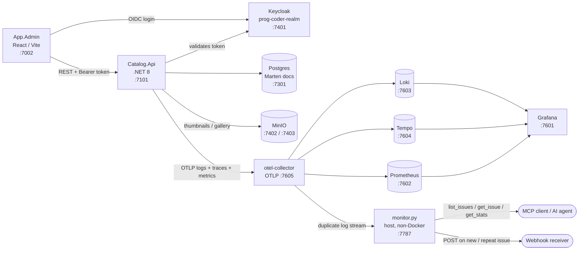

# System Architecture & Use-Case Status

A 10-container cut of the original 47-container e-commerce reference app. One admin-managed product catalog, end to end, plus a full three-pillar observability stack — built deliberately small to give an AI monitoring agent (AMS) real, verifiable signals to detect.

Everything below reflects what was actually exercised in the session that built this slice: real HTTP calls against the running stack, real Loki/Tempo queries, a real MCP client. Where something is present in code but wasn't independently re-tested, it's marked **wired** rather than **working** — that distinction is deliberate, not hedging.

| | | | |
|---|---|---|---|
| **10** containers | **1** non-Docker process | **2** seeded defects (0 live) | commit `304172f` · 2026-08-10 |

## Topology

How a request moves through the stack:

**otel-collector fans every log line out twice**: once to Loki (everything, unfiltered — unchanged from before this session), and once to `monitor.py` (a straight duplicate, filtered down to Warning/Error/Fatal on the monitor's own side). No line in Catalog.Api was touched to make that second path exist.

## Deployed layers

Ten containers, one process outside Docker.

### Frontend & API

| Service | Port | What it does |
|---|---|---|
| `app-admin` | `:7002` | React/Vite admin SPA. Keycloak login, product/category/brand management. Nginx-served static build; API base URL is baked in at build time via Vite env vars. |
| `catalog-api` | `:7101` | .NET 8, Clean Architecture (Api / Application / Domain / Infrastructure). MediatR for CQRS, Marten for document persistence, Carter for minimal-API endpoints. The only backend service left in this slice. |

### Data & storage

| Service | Port | What it does |
|---|---|---|
| `postgres-sql` | `:7301` | Backs both Catalog.Api (via Marten, as a document store — not relational tables) and Keycloak's own schema. |
| `minio` | `:7402` api / `:7403` console | S3-compatible object storage for product thumbnails and gallery images, uploaded through Catalog.Api. |

### Identity

| Service | Port | What it does |
|---|---|---|
| `keycloak` | `:7401` | OIDC provider, realm `prog-coder-realm`. Every admin endpoint validates the Bearer token against it; `ValidateAudience` is off, so only Authority + Audience matter. |

### Observability — kept in full, all three pillars

| Service | Port | What it does |
|---|---|---|
| `otel-collector` | OTLP gRPC `:7605` | Receives every log, trace and metric Catalog.Api emits; fans logs out to both Loki and the standalone monitor, traces to Tempo, metrics to Prometheus. |
| `loki` | `:7603` | Log storage, queried via LogQL. Structured metadata (severity, exception type, trace id) travels per-line, not as indexed labels. |
| `tempo` | `:7604` | Distributed trace storage. 25% head-based sampling is configured on the app side, not here. |
| `prometheus` | `:7602` | Scrapes the collector's own metrics exporter; app metrics arrive via OTLP push, not a separate scrape target. |
| `grafana` | `:7601` | Four dashboards kept: *Logging & Tracing via Loki*, *MinIO*, *PG Microservices Monitoring*, *Prometheus Stats*. Datasources: Prometheus, Loki, Tempo. |

### AMS monitor — runs on the host, not in Docker

| Service | Port | What it does |
|---|---|---|
| `monitor.py` | `:7787` | Receives the duplicated log stream, deduplicates Warning/Error/Fatal into counted issues on the filesystem, fires webhooks, and serves `list_issues` / `get_issue` / `get_stats` / `list_recent_occurrences` as MCP tools over Streamable HTTP. Gated by a shared API key once reachable beyond localhost. |

## Use cases

What's confirmed running in this slice.

**Status key** — ✅ `working`: exercised end-to-end this session · 🔹 `wired`: implemented, reachable, not re-tested this session · 🔺 `seeded`: intentional defect, working as designed to fail · ⚪ `dead`: UI exists, nothing behind it · ⬛ `removed`: not present at all

### Product catalog (admin, authenticated)

| Status | Use case |
|---|---|
| ✅ working | Create product, incl. thumbnail + gallery upload to MinIO |
| ✅ working | Update product — price, sale price, images, tags, SEO fields |
| ✅ working | Publish / unpublish a product |
| ✅ working | List all products / paged products (admin views) |
| 🔹 wired | Delete product |
| 🔹 wired | Category CRUD + category tree |
| 🔹 wired | Brand CRUD |

### Public catalog API (no auth)

| Status | Use case |
|---|---|
| 🔹 wired | `GET /products`, `GET /products/{id}` — published items only. Reachable directly (curl / Swagger); nothing in this slice calls it, since the App.Store frontend that used to was removed. |

### Identity

| Status | Use case |
|---|---|
| ✅ working | Admin login via Keycloak (OIDC, `prog-coder-realm`) |
| ✅ working | Bearer-token validation on every admin endpoint |

### Observability pipeline

| Status | Use case |
|---|---|
| ✅ working | Structured logs → OTLP → Loki |
| ✅ working | Distributed traces → OTLP → Tempo, incl. error-tagged spans |
| ✅ working | Metrics → OTLP → Prometheus |
| ✅ working | Grafana dashboards over all three pillars (fixed a stale log-panel query this session) |

### AMS seeded incidents — the actual point of this deployment

| Status | Use case |
|---|---|
| 🔺 seeded · live | Opening any **unpublished** product's detail view → `NullReferenceException` → HTTP 500 + Error log + error-tagged span |
| ✅ fixed | Any product with `SalePrice = 0` used to throw `DivideByZeroException` on the *entire* admin product list ("Dell XPS 15" was the poisoned record). The discount badge now skips non-derivable discounts — covered by `tests/Catalog.Application.Tests`. |

### AMS monitor (standalone, non-Docker)

| Status | Use case |
|---|---|
| ✅ working | Duplicated OTLP log stream from the collector — zero app-code changes |
| ✅ working | Dedup by fingerprint → one file per issue, severity-organized, with an occurrence counter |
| ✅ working | Webhook fired on new and repeat occurrences |
| ✅ working | MCP tools served over Streamable HTTP, verified with a real MCP client |
| ✅ working | Shared API-key auth on `/mcp` and `/v1/logs` |
| 🔹 wired | LAN reachability — bound to all interfaces; firewall rule and keeping the process running are on you to complete |

## Out of scope

### Dead nav

UI exists in App.Admin, but any list or action on these pages calls a service that isn't in this stack:

- ⚪ Orders
- ⚪ Inventory
- ⚪ Coupons
- ⚪ Reports
- ⚪ Notifications *(bell icon was removed entirely — it polled a dead endpoint every 30s)*

### Further scope for adding

Not present in this slice — candidates if the scope grows back out:

- ⬛ API Gateway (YARP)
- ⬛ RabbitMQ + MassTransit
- ⬛ App.Store, App.Job
- ⬛ Basket / Discount / Feedback / Identity / Inventory / Notification / Order / Report / Search services
- ⬛ MySQL, SQL Server, MongoDB, Elasticsearch, Redis

---

Full detail on how each bug was found and fixed lives in the repo: `README.md`, `DEV-RUNBOOK.md`, `APPLICATION-OVERVIEW.md`, `../monitor/README.md`.

*progcoder-shop-microservices · minimal AMS observability slice · commit `304172f`*
